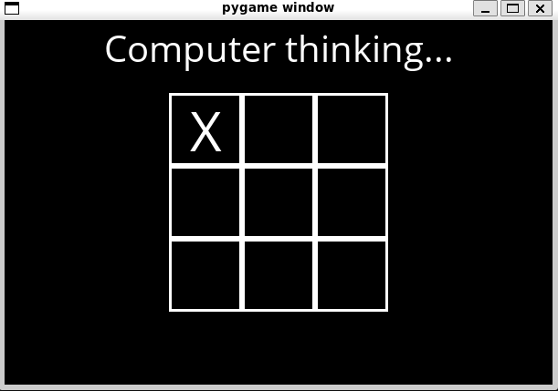
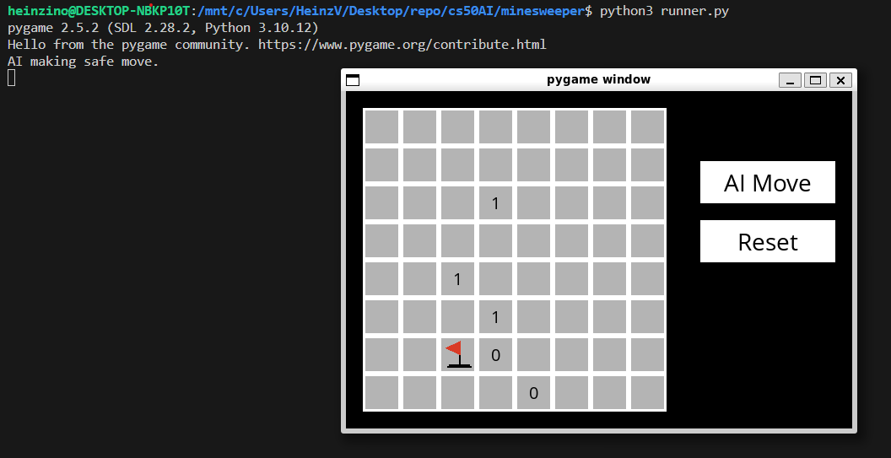
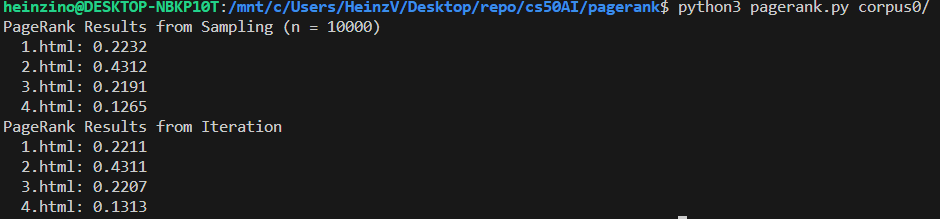
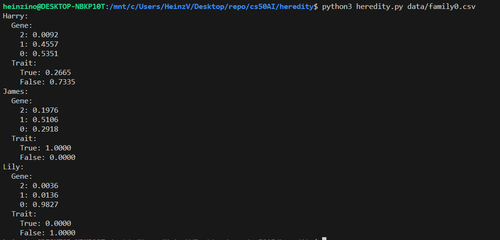
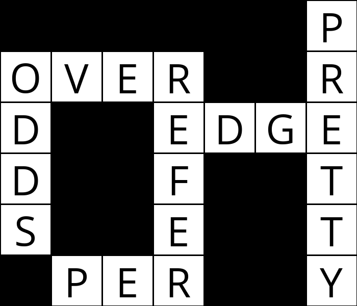
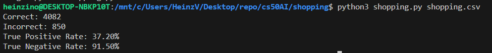
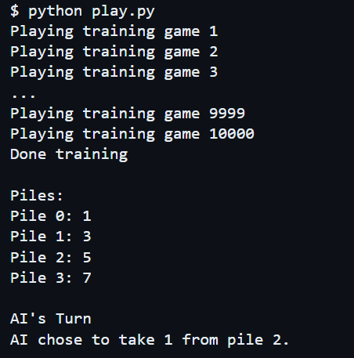
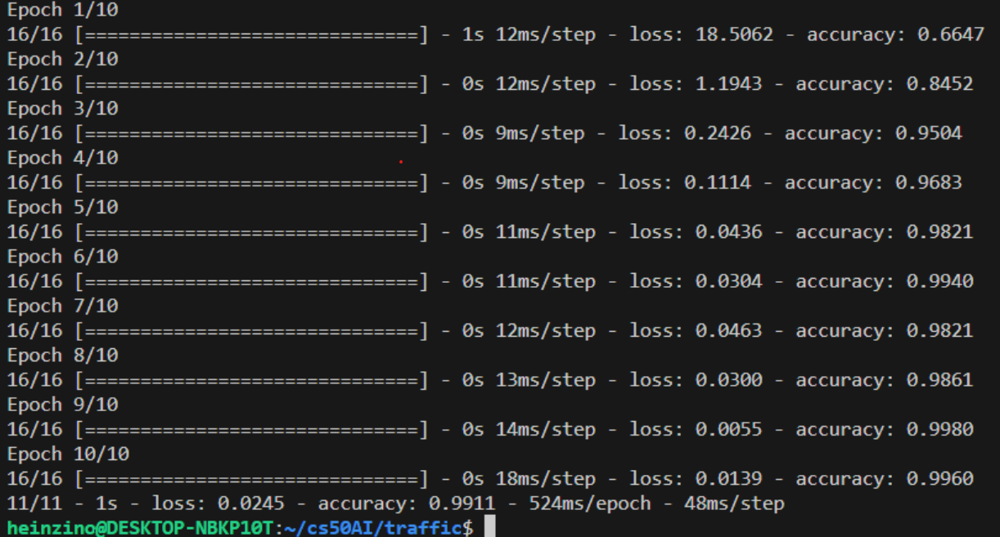

# cs50AI
Projects and Problem Sets for CS50’s Introduction to Artificial Intelligence with Python

# Week 0: Search Problems
Depth-First Search. Breadth-First Search. Greedy Best-First Search. A* Search. Minimax. Alpha-Beta Pruning.

[Degrees](https://github.com/Heinzino/cs50AI/tree/main/degrees)
Use a BFS search with IMDb data to determine the 'degrees of separation' between two actors.

[TicTacToe](https://github.com/Heinzino/cs50AI/tree/main/tictactoe)
Using minimax to have an AI play tic-tac-toe optimally. Built using test-driven development principles.

# Week 1: Knowledge Problems
Propositional Logic. Entailment. Inference. Model Checking. Resolution. First Order Logic.

[Knights](https://github.com/Heinzino/cs50AI/tree/main/knights)
Create a knowledge base to evaluate propositional logic to solve logic puzzles.

[Minesweeper](https://github.com/Heinzino/cs50AI/tree/main/minesweeper)
AI that plays Minesweeper using logical inferences to make moves.

# Week 2: Uncertainity Problems
Probability. Conditional Probability. Random Variables. Independence. Bayes’ Rule. Joint Probability. Bayesian Networks. Sampling. Markov Models. Hidden Markov Models.

[PageRank](https://github.com/Heinzino/cs50AI/tree/main/pagerank)
AI uses PageRank Algorithim to rank web pages by importance.

[Heredity](https://github.com/Heinzino/cs50AI/tree/main/heredity)
Uses a Bayseian Network to assess the likelihood that a person will have a particular genetic trait.

# Week 3: Optimization Problems
Local Search. Hill Climbing. Simulated Annealing. Linear Programming. Constraint Satisfaction. Backtracking Search.

[Crossword](https://github.com/Heinzino/cs50AI/tree/main/crossword)
Write an AI to generate crossword puzzles.

# Week 4: Learning Problems
Supervised Learning. Nearest-Neighbor Classification. Perceptron Learning. Support Vector Machines. Regression. Loss Functions. Overfitting. Regularization. Reinforcement Learning. Markov Decision Processes. Q-Learning. Unsupervised Learning. k-means Clustering.

[Shopping](https://github.com/Heinzino/cs50AI/tree/main/shopping)
AI that predicts whether online customers will complete a purchase.

[Nim](https://github.com/Heinzino/cs50AI/tree/main/nim)
Write an AI that teaches itself to play Nim through reinforcement learning.

# Week 5: Neural Networks
Artificial Neural Networks. Activation Functions. Gradient Descent. Backpropagation. Overfitting. TensorFlow. Image Convolution. Convolutional Neural Networks. Recurrent Neural Networks.

[Traffic](https://github.com/Heinzino/cs50AI/tree/main/traffic)
Convolutional Neural Network to identify traffic signs

